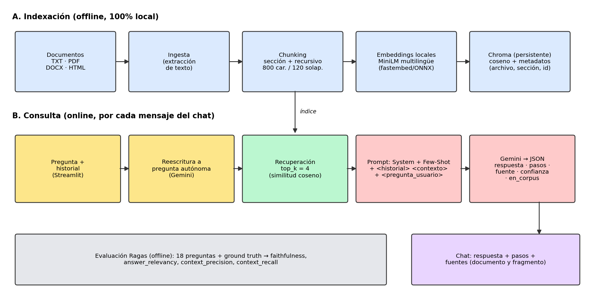

# Asistente Experto de Soporte Técnico basado en RAG — Avance 2

Karolina Suarez (506231095) · Valentina Tangarife (506241718)

Asistente que responde preguntas sobre manuales técnicos (impresora X200 y router ND-1800) con **RAG de extremo a extremo**, evaluación con **Ragas** y una interfaz de **chat conversacional** en Streamlit.

- 🌐 **URL pública de la aplicación:** https://avance-proyecto-2-hqputjjorbunhafsspn7o4.streamlit.app/
- 📦 **Repositorio:** https://github.com/ka135/Avance-proyecto-2.git

> **Privacidad:** el corpus, los embeddings y el índice vectorial se procesan y almacenan **localmente**. El LLM solo recibe la pregunta, el historial reciente y los `top_k` fragmentos recuperados; nunca el corpus completo.

## 1. Flujo RAG implementado



| Etapa | Implementación | Archivo | Decisión y justificación |
|---|---|---|---|
| Selección de documentos | 2 manuales técnicos (`documentos/`) | — | Dominio acotado de soporte técnico; con 2 productos se puede evaluar si el sistema recupera del manual correcto. Se reemplazan por los manuales reales sin tocar código. |
| Ingesta | TXT/MD, PDF (`pypdf`, por página), DOCX (`python-docx`, títulos → `##`), HTML (`beautifulsoup4`) | `src/rag/ingest.py` | Cubre los 4 formatos pedidos; conserva títulos y nº de página para citar. |
| Chunking | 1) corte por **secciones**; 2) división recursiva línea → oración → palabra, **800 caracteres, solape 120** | `src/rag/chunking.py` | Un procedimiento de soporte (pasos 1-2-3) debe quedar completo: ningún fragmento cruza secciones. 800 car. ≈ 1 procedimiento; 120 car. (~15 %) evita perder pasos en el borde. |
| Vectorización | `paraphrase-multilingual-MiniLM-L12-v2` (384 dim) vía **fastembed/ONNX**, local | `src/rag/embeddings.py` | Multilingüe (manuales y preguntas en español), liviano para el plan gratuito de la nube y **sin enviar el corpus a terceros**. |
| Base vectorial | **Chroma** persistente (`chroma_db/`), distancia coseno. Metadatos: `source`, `section`, `page`, `chunk_id` | `src/rag/vectorstore.py` | Persistencia simple y metadatos para citar documento y fragmento. El título de sección se antepone solo al embeber. |
| Recuperación | **Híbrida**: 0.7 × coseno + 0.3 × coincidencia de términos exactos, `top_k = 4` (`--no-hybrid` en la evaluación = solo coseno) | `src/rag/retriever.py` | Los embeddings fallan con códigos como "E04"; la parte léxica los recupera. 4 fragmentos cubren respuestas que combinan secciones (p. ej. error + procedimiento) sin llenar el prompt de ruido. |
| Conversación | Reescritura de la pregunta de seguimiento a pregunta autónoma antes de buscar | `src/rag/pipeline.py` | "¿Y si es de 5 GHz?" no se puede buscar sola; se reformula con el historial. |
| Generación | System Prompt + Few-Shot + etiquetas XML + JSON de salida (Avance 1, refinados). LLM: `openai/gpt-oss-120b` en Groq | `src/rag/prompts.py`, `generator.py` | Ver sección 2. |

## 2. Refinamientos al prompt del Avance 1

- Nuevo campo **`en_corpus`** (bool) en el JSON de salida para que la interfaz distinga "no está en el manual".
- Tercer ejemplo **Few-Shot** de pregunta fuera de alcance (respuesta negativa, `pasos: []`, `fuente: "ninguna"`).
- Los ejemplos ahora incluyen su `<contexto>` con el formato real `[Fuente | Sección | Fragmento]`.
- Nueva etiqueta **`<historial>`** (solo para interpretar la pregunta, nunca como evidencia) y regla anti-inyección ampliada a todas las etiquetas.
- El System Prompt se envía como mensaje de sistema y la salida JSON se fuerza con el modo JSON del proveedor (`response_format` en Groq/Mistral; `system_instruction` y `response_mime_type="application/json"` en Gemini).
- Reintentos con espera exponencial ante errores 503/429.

## 3. Estructura del repositorio

```
app.py                      # Chat Streamlit
src/rag/                    # config, ingest, chunking, embeddings, vectorstore, retriever, prompts, generator, pipeline
scripts/build_index.py      # Construye el índice manualmente
eval/preguntas_eval.json    # 18 preguntas (14 en corpus + 4 fuera de corpus) con ground truth
eval/run_ragas.py           # Evaluación Ragas
eval/compare.py             # Tabla y gráfico antes/después
eval/resultados/            # CSV/JSON de cada corrida
documentos/                 # Corpus
docs/diagrama_flujo_rag.png
```

## 4. Instalación y ejecución local

> **Python 3.11 o 3.12** (recomendado 3.12). Con 3.13/3.14 la evaluación no se instala porque `scikit-network` (dependencia de Ragas) no tiene paquetes precompilados. El chat (`requirements.txt`) sí funciona en versiones recientes.

```bash
git clone https://github.com/ka135/Avance-proyecto-2.git && cd Avance-proyecto-2
python -m venv .venv && source .venv/bin/activate      # Windows: .venv\Scripts\activate
pip install -r requirements.txt
cp .env.example .env                                   # Windows: copy .env.example .env  (y edita tu clave)
streamlit run app.py
```

El índice se construye automáticamente la primera vez (también con `python scripts/build_index.py --rebuild`). La primera ejecución descarga el modelo de embeddings (~120 MB).

### Variables de entorno

Crea un archivo `.env` en la raíz del proyecto (está en `.gitignore`: **nunca lo subas al repositorio**). Configuración usada en el despliegue:

```dotenv
LLM_PROVIDER=groq
GROQ_API_KEY=tu_clave_de_groq
LLM_MODEL=openai/gpt-oss-120b
```

| Variable | Descripción |
|---|---|
| `LLM_PROVIDER` | Proveedor del LLM: `groq`, `mistral` o `gemini` |
| `GROQ_API_KEY` | Clave de Groq, que se obtiene en https://console.groq.com (o `MISTRAL_API_KEY` / `GEMINI_API_KEY` según el proveedor) |
| `LLM_MODEL` | Modelo a usar (aquí `openai/gpt-oss-120b`) |

En Streamlit Community Cloud estas mismas variables se pegan en **Advanced settings → Secrets**, nunca en el repositorio.

**Proveedor de LLM (gratuito).** El proyecto soporta Groq, Mistral y Gemini; los embeddings siguen siendo locales. El plan gratuito de Gemini limita a ~20 solicitudes/día por modelo, insuficiente para evaluar con Ragas, y la cuota de Groq también obligó a evaluar con 15 preguntas (ver sección 8).

> Si usas una clave Gemini del formato nuevo (`AQ...`) y obtienes errores 401, actualiza el SDK: `pip install -U google-genai`.

## 5. Evaluación con Ragas

```bash
pip install -r requirements-eval.txt   # versiones fijadas (ragas 0.2.15); Python 3.11/3.12

# "Antes": recuperación solo por coseno
python eval/run_ragas.py --tag sin_hibrido --no-hybrid

# "Después": recuperación híbrida (configuración final)
python eval/run_ragas.py --tag hibrido

# Tabla markdown + gráfico PNG de la comparación
python eval/compare.py sin_hibrido hibrido
```

- Genera `eval/resultados/<tag>_detalle.csv` (por pregunta), `<tag>_resumen.json` (global y por tipo) y el gráfico de comparación.
- Métricas: `faithfulness`, `answer_relevancy`, `context_precision` (con referencia) y `context_recall`. El juez es el mismo LLM generador (`openai/gpt-oss-120b` en Groq) y los embeddings de `answer_relevancy` son los mismos locales del pipeline.
- El conjunto incluye 4 preguntas **fuera de corpus** (ground truth: "La información no está disponible en los manuales.") para medir control de alucinaciones; `por_tipo` en el resumen las separa.
- Con planes gratuitos el script espera entre preguntas (`--sleep`) y usa pocos hilos (`--workers`). Si hay errores 429, ajusta esos valores o usa `--reuse` para no regenerar respuestas.
- Si cambias el corpus, **reescribe `eval/preguntas_eval.json`** con preguntas y ground truth de tus propios documentos.

## 6. Despliegue (Streamlit Community Cloud)

1. Sube el repositorio a GitHub (sin `.env` ni `secrets.toml`; ya están en `.gitignore`).
2. En <https://share.streamlit.io> → **Create app** → elige el repo, rama `main` y archivo `app.py`.
3. En **Advanced settings → Secrets** pega:
   ```toml
   LLM_PROVIDER = "groq"
   GROQ_API_KEY = "tu_clave"
   LLM_MODEL = "openai/gpt-oss-120b"
   ```
4. En **Advanced settings → Python version** elige **3.12**.
5. **Deploy.** El índice se reconstruye al arrancar (el disco de la plataforma es efímero) y la URL pública queda disponible.

Alternativa: Hugging Face Spaces (SDK Streamlit) con la clave en *Settings → Secrets*.

## 7. Ejemplos de uso

1. Conversación con seguimiento: "¿Cómo conecto la impresora al WiFi?" → "¿Y si mi red es de 5 GHz?" → "¿Qué hago si aun así no imprime?".
2. Pregunta fuera del corpus: "¿Cuántos años tengo?" o "¿Cómo configuro una VPN en el router?". La interfaz muestra el aviso de que la información no está en los manuales y `en_corpus = false`.

## 8. Resultados de la evaluación (Ragas)

Modelo generador y juez: `openai/gpt-oss-120b` (Groq). Embeddings locales. 15 preguntas de `eval/preguntas_eval.json` (14 dentro del corpus y 1 fuera), por los límites del plan gratuito. Iteración de mejora: recuperación solo por coseno → recuperación híbrida (0.7 coseno + 0.3 coincidencia de términos). El resto de parámetros no cambió (chunk 800, solape 120, top_k = 4).

| Métrica | Solo coseno | Híbrida | Δ |
|---|---|---|---|
| faithfulness | 0.706 | 0.713 | +0.007 |
| answer_relevancy | 0.771 | 0.738 | -0.033 |
| context_precision | 0.856 | 0.867 | +0.011 |
| context_recall | 0.833 | 0.900 | +0.067 |

Con solo 15 preguntas y un juez LLM, diferencias de ~0.03 no son concluyentes; la mejora más clara es `context_recall`. La métrica más baja es `faithfulness` (≈ 0.71), atribuida a la generación. Detalle por pregunta en `eval/resultados/*_detalle.csv`.
